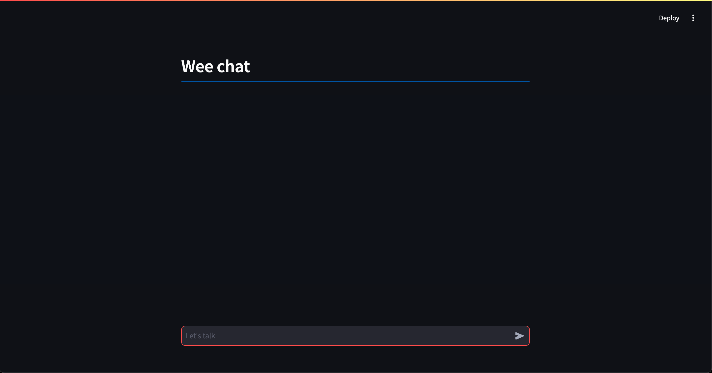

# Ilhama Chat Project

A simple chat application that uses the Ollama model with Langchain and is built with Streamlit.

## Features

- **Chat Input:** Users can input prompts to chat with the Llama model.
- **Real-Time Responses:** Responses from the Llama model are displayed as users type their prompts.
- **Streamlit Interface:** A clean and interactive interface built using Streamlit.
- **Simple Chat UI:** The app provides a basic chat interface with a header and input field.

## Screenshot



## Installation

1. Clone the repository:
   ```bash
   git clone https://github.com/sarahcalbez/ilhama.git

2.	Navigate to the project folder:

    ```bash
    cd ilhama
    ````
3.	Create a virtual environment:
    ```bash
    python3 -m venv .venv
    ````
    OR simply go to View > Command palette > Create environment virtual
4.	Activate the virtual environment:
    ```bash
    source .venv/bin/activate
    ````
5.	Install the required dependencies:
    ```bash
    pip install streamlit
    ````
	  Note: Sometimes the IDE needs to be restarted after installing dependencies in order for them to be properly recognized.
  	<br>
  	Create a requirements.txt file and add the following dependencies:
    ```bash
    slangchain
    langchain_community
    streamlit
    ````
    Then, install the dependencies:
    ```bash
    pip install -r requirements.txt
    ````
7.	Run the app:
    ```bash
    streamlit run app.py
    ```` 

## Technologies Used

- **Langchain:** A framework for building applications with large language models (LLMs).
- **Langchain Community:** A community module for interacting with different LLM models.
- **Streamlit:** A Python framework for building interactive web apps with minimal effort.

## License

This project is available for free access and use for educational purposes.